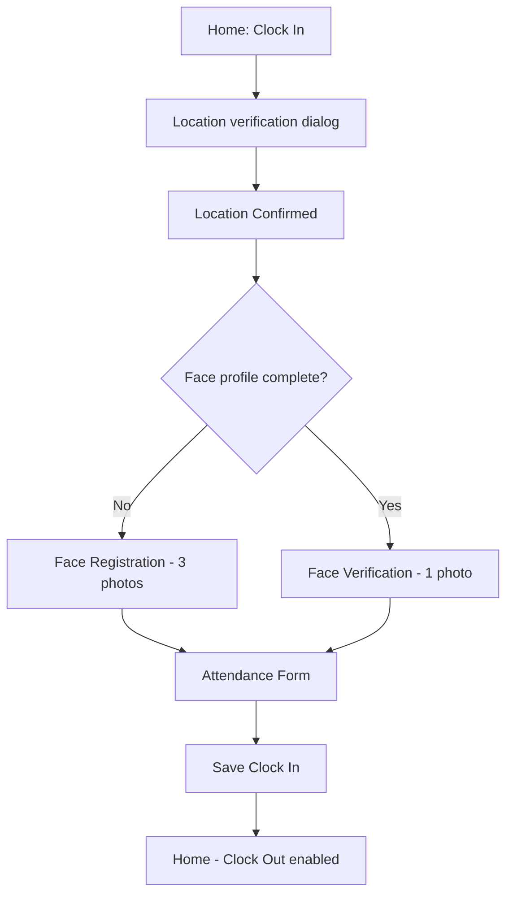

# Clock in on mobile

## When to use

You are starting your work day and need to record attendance from the ESS CPS mobile app.

## Prerequisites

- Signed in on [Mobile: Home](/docs/en/manual/mobile/pages/mobile-dashboard).
- Location permission allowed for ESS CPS (Android or iOS settings).
- Face registered if your company requires it (three photos on first use).

## Flow overview

## Steps

1. On [Mobile: Home](/docs/en/manual/mobile/pages/mobile-dashboard), tap **Clock In**.
2. Wait while the app shows **Clock-In Verification in Progress** (location dialog). Allow GPS access if the system prompts you. The dialog closes when your position is validated.
3. On [Mobile: Location Confirmed](/docs/en/manual/mobile/pages/mobile-location-confirmed), read the success message, then tap:
   - **Register Your Face** — if this is your first time (fewer than three face photos), or
   - **Start Verification** — if you already registered your face.
4. **Face step** (skip if your company does not require it):
   - **Registration:** On [Mobile: Face Registration](/docs/en/manual/mobile/pages/mobile-face-registration), take **front**, **right**, and **left** photos in order. Wait for **Face Registration Success!**
   - **Verification:** On [Mobile: Face Verification](/docs/en/manual/mobile/pages/mobile-face-verification), tap **Take Photo**, face the camera, and wait for **Face Verification Success!**
5. On [Mobile: Attendance Form](/docs/en/manual/mobile/pages/mobile-attendance-form):
   - Review the date, clock-in time, and **Location** on the summary card.
   - Tap **Shift** and select your working shift (required).
   - Add **Notes** if needed (optional).
   - Tap **Save Clock In**.
6. You return to **Home**. **Clock Out** is now enabled. Your record appears under **Profile** → **Attendance and Overtime** for the current month.

## Expected result

- Today’s clock-in time is saved.
- **Clock Out** on Home is active.
- Recent Activity on Home may show the new attendance event.

## Common mistakes

- **Location denied** — Enable location for ESS CPS in device settings; stand inside your company’s allowed work radius.
- **Location is not valid** — You are too far from the site; move closer and try **Clock In** again.
- **Face mismatch or registration failed** — Use good lighting, face the camera, and retry. Contact HR if problems continue.
- **Please fill all required fields** — Select a **Shift** before **Save Clock In**.
- **Clock Out still disabled** — Finish clock-in successfully first; do not tap **Back** on the attendance form instead of saving.

## Related

- [Clock out on mobile](/docs/en/workflows/mobile-clock-out) — End your shift after clocking in.
- [Mobile: Attendance & Overtime](/docs/en/manual/mobile/pages/mobile-attendance) — View history and request corrections.
