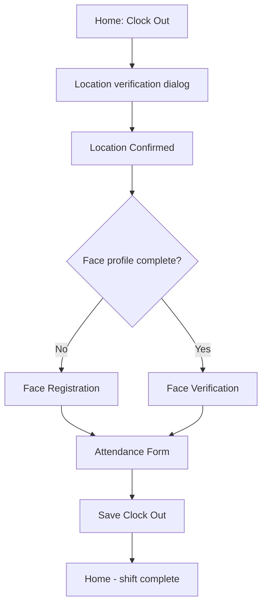

# Clock out on mobile

## When to use

You are ending your work day after you have already clocked in successfully today.

## Prerequisites

- You completed [Clock in on mobile](/docs/en/workflows/mobile-clock-in) today.
- On [Mobile: Home](/docs/en/manual/mobile/pages/mobile-dashboard), **Clock Out** is enabled (not greyed out).

## Flow overview

## Steps

1. On [Mobile: Home](/docs/en/manual/mobile/pages/mobile-dashboard), confirm **Clock Out** is enabled, then tap **Clock Out**.
2. Wait for **Clock-Out Verification in Progress** while the app validates your GPS position (same dialog as clock-in).
3. On [Mobile: Location Confirmed](/docs/en/manual/mobile/pages/mobile-location-confirmed), tap **Start Verification** or **Register Your Face** if needed.
4. Complete [Mobile: Face Verification](/docs/en/manual/mobile/pages/mobile-face-verification) or [Mobile: Face Registration](/docs/en/manual/mobile/pages/mobile-face-registration) when prompted—the same steps as clock-in.
5. On [Mobile: Attendance Form](/docs/en/manual/mobile/pages/mobile-attendance-form):
   - Review clock-in and clock-out times, duration, and **Location** on the summary card.
   - **Shift** is shown but cannot be changed on clock-out.
   - Add **Notes** if needed (optional).
   - Tap **Save Clock Out**.
6. You return to **Home**. Today’s attendance record includes both clock-in and clock-out times. View it under **Profile** → **Attendance and Overtime**.

## Expected result

- Clock-out time is saved for today.
- Duration and overtime on the summary card reflect your times.
- The attendance row in history shows **Approved**, **Waiting**, or your company’s status label.

## Common mistakes

- **Clock Out disabled** — Clock in first; you cannot clock out without an active clock-in for today.
- **No active attendance found** — Your clock-in may have failed or been cleared; clock in again, then clock out.
- **Skipped location or face** — Complete every prompted step; do not force-close the app mid-flow.
- **Wrong times on the form** — Times are captured at verification; if incorrect, use [Mobile: Edit Attendance](/docs/en/manual/mobile/pages/mobile-attendance-edit) after saving.

## Related

- [Clock in on mobile](/docs/en/workflows/mobile-clock-in) — Start your day.
- [Mobile: Attendance & Overtime](/docs/en/manual/mobile/pages/mobile-attendance) — Review or correct past records.
