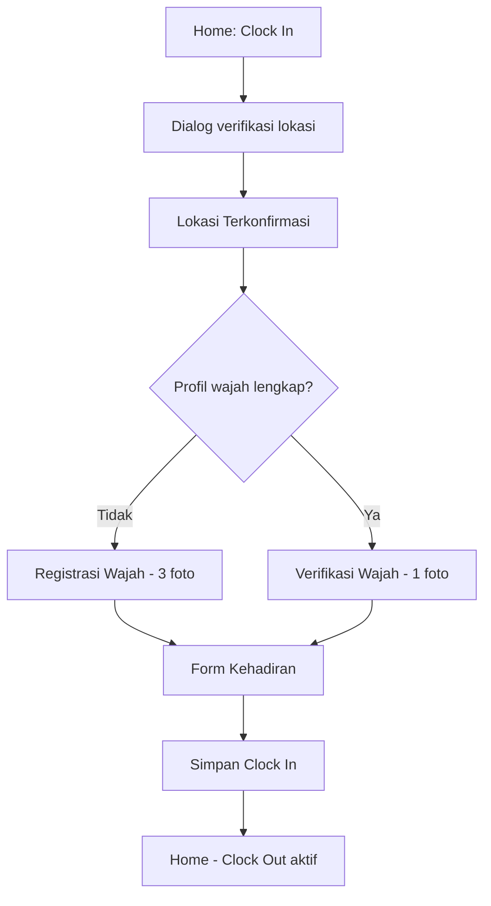

# Clock in di mobile

## Kapan menggunakan

Anda memulai hari kerja dan perlu mencatat kehadiran dari aplikasi mobile ESS CPS.

## Prasyarat

- Sudah masuk di [Mobile: Home](/docs/manual/mobile/pages/mobile-dashboard).
- Izin lokasi diizinkan untuk ESS CPS (pengaturan Android atau iOS).
- Wajah terdaftar jika perusahaan Anda mewajibkannya (tiga foto pada penggunaan pertama).

## Ringkasan alur

## Langkah

1. Di [Mobile: Home](/docs/manual/mobile/pages/mobile-dashboard), ketuk **Clock In**.
2. Tunggu sementara aplikasi menampilkan **Clock-In Verification in Progress** (dialog lokasi). Izinkan akses GPS jika sistem meminta. Dialog tertutup saat posisi Anda divalidasi.
3. Di [Mobile: Location Confirmed](/docs/manual/mobile/pages/mobile-location-confirmed), baca pesan sukses, lalu ketuk:
   - **Register Your Face** — jika ini pertama kali (kurang dari tiga foto wajah), atau
   - **Start Verification** — jika Anda sudah mendaftarkan wajah.
4. **Langkah wajah** (lewati jika perusahaan Anda tidak mewajibkannya):
   - **Registrasi:** Di [Mobile: Face Registration](/docs/manual/mobile/pages/mobile-face-registration), ambil foto **depan**, **kanan**, dan **kiri** secara berurutan. Tunggu **Face Registration Success!**
   - **Verifikasi:** Di [Mobile: Face Verification](/docs/manual/mobile/pages/mobile-face-verification), ketuk **Take Photo**, hadap kamera, dan tunggu **Face Verification Success!**
5. Di [Mobile: Attendance Form](/docs/manual/mobile/pages/mobile-attendance-form):
   - Tinjau tanggal, waktu clock-in, dan **Location** pada kartu ringkasan.
   - Ketuk **Shift** dan pilih shift kerja Anda (wajib).
   - Tambahkan **Notes** jika perlu (opsional).
   - Ketuk **Save Clock In**.
6. Anda kembali ke **Home**. **Clock Out** sekarang aktif. Catatan Anda muncul di **Profile** → **Attendance and Overtime** untuk bulan berjalan.

## Hasil yang diharapkan

- Waktu clock-in hari ini tersimpan.
- **Clock Out** di Home aktif.
- Recent Activity di Home mungkin menampilkan kejadian kehadiran baru.

## Kesalahan umum

- **Lokasi ditolak** — Aktifkan lokasi untuk ESS CPS di pengaturan perangkat; berdiri di dalam radius kerja yang diizinkan perusahaan Anda.
- **Location is not valid** — Anda terlalu jauh dari lokasi; mendekatlah dan coba **Clock In** lagi.
- **Wajah tidak cocok atau registrasi gagal** — Gunakan pencahayaan yang baik, hadap kamera, dan coba lagi. Hubungi HR jika masalah berlanjut.
- **Please fill all required fields** — Pilih **Shift** sebelum **Save Clock In**.
- **Clock Out masih nonaktif** — Selesaikan clock-in terlebih dahulu; jangan ketuk **Back** di form kehadiran alih-alih menyimpan.

## Terkait

- [Clock out di mobile](/docs/workflows/mobile-clock-out) — Akhiri shift setelah clock in.
- [Mobile: Attendance & Overtime](/docs/manual/mobile/pages/mobile-attendance) — Lihat riwayat dan minta koreksi.
