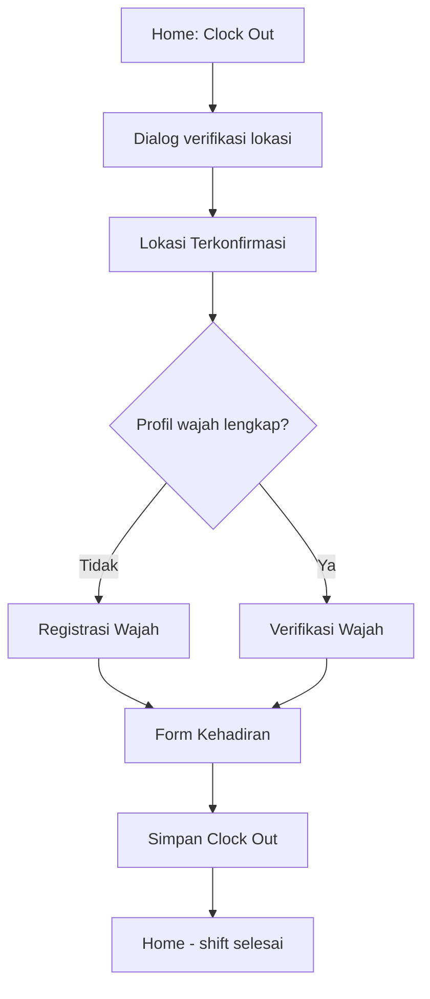

# Clock out di mobile

## Kapan menggunakan

Anda mengakhiri hari kerja setelah berhasil clock in hari ini.

## Prasyarat

- Anda menyelesaikan [Clock in di mobile](/docs/workflows/mobile-clock-in) hari ini.
- Di [Mobile: Home](/docs/manual/mobile/pages/mobile-dashboard), **Clock Out** aktif (tidak abu-abu).

## Ringkasan alur

## Langkah

1. Di [Mobile: Home](/docs/manual/mobile/pages/mobile-dashboard), pastikan **Clock Out** aktif, lalu ketuk **Clock Out**.
2. Tunggu **Clock-Out Verification in Progress** sementara aplikasi memvalidasi posisi GPS Anda (dialog yang sama dengan clock-in).
3. Di [Mobile: Location Confirmed](/docs/manual/mobile/pages/mobile-location-confirmed), ketuk **Start Verification** atau **Register Your Face** jika diperlukan.
4. Lengkapi [Mobile: Face Verification](/docs/manual/mobile/pages/mobile-face-verification) atau [Mobile: Face Registration](/docs/manual/mobile/pages/mobile-face-registration) saat diminta—langkah yang sama dengan clock-in.
5. Di [Mobile: Attendance Form](/docs/manual/mobile/pages/mobile-attendance-form):
   - Tinjau waktu clock-in dan clock-out, durasi, serta **Location** pada kartu ringkasan.
   - **Shift** ditampilkan tetapi tidak dapat diubah saat clock-out.
   - Tambahkan **Notes** jika perlu (opsional).
   - Ketuk **Save Clock Out**.
6. Anda kembali ke **Home**. Catatan kehadiran hari ini mencakup waktu clock-in dan clock-out. Lihat di **Profile** → **Attendance and Overtime**.

## Hasil yang diharapkan

- Waktu clock-out tersimpan untuk hari ini.
- Durasi dan lembur pada kartu ringkasan mencerminkan waktu Anda.
- Baris kehadiran di riwayat menampilkan **Approved**, **Waiting**, atau label status perusahaan Anda.

## Kesalahan umum

- **Clock Out nonaktif** — Clock in terlebih dahulu; Anda tidak dapat clock out tanpa clock-in aktif untuk hari ini.
- **Tidak ada kehadiran aktif** — Clock-in Anda mungkin gagal atau dihapus; clock in lagi, lalu clock out.
- **Melewati lokasi atau wajah** — Selesaikan setiap langkah yang diminta; jangan memaksa menutup aplikasi di tengah alur.
- **Waktu salah di form** — Waktu dicatat saat verifikasi; jika salah, gunakan [Mobile: Edit Attendance](/docs/manual/mobile/pages/mobile-attendance-edit) setelah menyimpan.

## Terkait

- [Clock in di mobile](/docs/workflows/mobile-clock-in) — Mulai hari kerja Anda.
- [Mobile: Attendance & Overtime](/docs/manual/mobile/pages/mobile-attendance) — Tinjau atau koreksi catatan sebelumnya.
